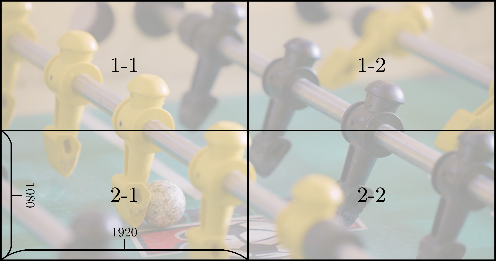
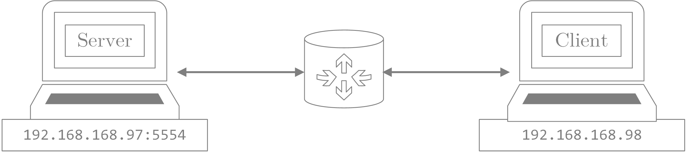
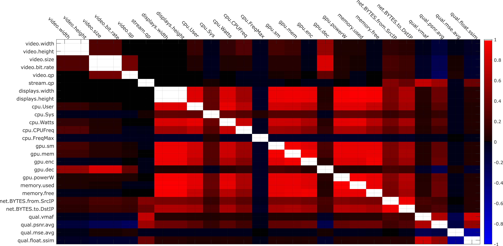

<a id="idtext"></a> 
#  EcoStream: Resource Utilization Dataset
Please feel free to [**view and download the dataset here**](https://drive.google.com/drive/folders/1EM_fpRZug_8PZEgvTQa-mqhfO0gYtv9y?usp=sharing) \
For comments, feedback, or question please [Contact Us](mailto:Tariq.AlShoura@ucalgary.ca?subject=Inquiry%20about%20the%20Resource%20Utilization%20Dataset) at: [Tariq.AlShoura@ucalgary.ca](mailto:Tariq.AlShoura@ucalgary.ca?subject=Inquiry%20about%20the%20Resource%20Utilization%20Dataset)

<!-- Please cite the following paper if using the dataset:
> Tariq Al Shoura, Ali Mollaahmadi Dehaghi, Reza Razavi, Behrouz Far, and Mohammad Moshirpour. 2023. SEPE Dataset: 8K Video Sequences and Images for Analysis and Development. In Proceedings of the 14th ACM Multimedia Systems Conference (MMSys ’23), June 7–10, 2023, Vancouver, BC, Canada.  -->

<br>

> [!NOTE]
> The sections numbering on the repo is done to align with the relevent content in the EcoStream Dataset paper

## Table of Contents
- [3.1 Data Collection Process ](#31-data-collection-process)
   * [3.1.1 Streams Provisioning](#311-streams-provisioning)
      + [Server-side](#server-side)
      + [Client-side](#client-side)
   * [3.1.2 Utilization Data Collection](#312-utilization-data-collection)
      + [Video File and Stream Data](#video-file-and-stream-data)
      + [CPU Utilization and Power Data](#cpu-utilization-and-power-data)
      + [Memory Utilization Data](#memory-utilization-data)
      + [GPU Utilization and Power Data](#gpu-utilization-and-power-data)
      + [Network Data](#network-data)
   * [3.1.3 Lab Setup](#313-lab-setup)
- [3.2 Data Points Collected](#32-data-points-collected)
   * [3.2.1 Video Stream Data](#321-video-stream-data)
   * [3.2.2 CPU Data](#322-cpu-data)
   * [3.2.3 Memory Data](#323-memory-data)
   * [3.2.4 GPU Data](#324-gpu-data)
- [4.2 Data Preprocessing](#42-data-preprocessing)
- [Appendix A: Data Samples](#appendix-a-data-samples)
   * [Video File and Stream Data Sample](#video-file-and-stream-data-sample)
   * [CPU Data Sample](#cpu-data-sample)
   * [Memory Data Sample](#memory-data-sample)
   * [GPU Data Sample](#gpu-data-sample)
   * [Network Data Sample](#network-data-sample)
- [Appendix B: Baseline Models Training Logs](#appendix-b-baseline-models-training-logs)
___


<br>
<br>


# 3.1 Data Collection Process 
This section presents the relevent codes and information used to collect the data.


## 3.1.1 Streams Provisioning
The following is the code structure used when streaming a video to a 2x2 video wall:

### Server-side
From the server-side, the streams are initialized using:
``` bash
ffmpeg -re -stream_loop 1 -c:v hevc -i $video_path
    -filter_complex "[0]scale=3840:2160,
    split=4[out1][out2][out3][out4];
    [out1]crop=1920:1080:0:0[stream1];
    [out2]crop=1920:1080:1920:0[stream2];
    [out3]crop=1920:1080:0:1080[stream3];
    [out4]crop=1920:1080:1920:1080[stream4];"
    -map [stream1] -vcodec hevc -qp:v $qp_val -f rtsp 
    -muxdelay 0.1 rtsp://localhost:8554/mount-1-1
    -map [stream2] -vcodec hevc -qp:v $qp_val -f rtsp 
    -muxdelay 0.1 rtsp://localhost:8554/mount-2-1
    -map [stream3] -vcodec hevc -qp:v $qp_val -f rtsp 
    -muxdelay 0.1 rtsp://localhost:8554/mount-1-2
    -map [stream4] -vcodec hevc -qp:v $qp_val -f rtsp 
    -muxdelay 0.1 rtsp://localhost:8554/mount-2-2
```

### Client-side
The following command is issued for each required client, where `$i` and `$j` are the index/address of the client on the video wall
``` bash
ffmpeg -y -i rtsp://$server_IP/mount-$i-$j -vcodec hevc_nvenc -qp:v 0 $filename-$i-$j.mp4
```
<br>
where the figure below shows a sample video highlighting the clients IDs


*__Figure 1.__ An illustration of a 2 × 2 video wall with clients' IDs*

[Back to Top](#idtext)
___

<br>
<br>


## 3.1.2 Utilization Data Collection
This section presents samples of the commands used to collect all relevent data in the paper.


### Video File and Stream Data
The data related to the video is gathered using ffprobe using the command:
``` bash
ffprobe -v error \
    -show_entries stream=avg_frame_rate,height,width,duration,nb_frames,codec_name,codec_type,pix_fmt \
    -show_entries format=filename,format_name,size,bit_rate \
    -of json=c=1 ${video_file_name}
```

The information is then parsed and stored in addition to the streaming parameter and the number of displays are then stored in  ```01-file_stream_data.csv```, a sample of output can be seen in [**<ins>here</ins>**](#video-file-and-stream-data-sample)
<br>

[Back to Top](#idtext)
___


### CPU Utilization and Power Data
The following is the baseline command to get the data, it should be noted that the timelines are recorded using linux functionalities such as `ts`, and the data is parsed and processed using `awk`.
``` bash
powerstat -n -f -t -D 1 ${streamCaptureDuration} >> ${outFile}.txt
```
*__Table  1__. CPU Variables Example*
<table>
  <tr>
    <th>Variable</th>
    <th>Value</th>
  </tr>
  <tr>
    <td><code>${streamCaptureDuration}</code></td>
    <td>35</td>
  </tr>
  <tr>
    <td><code>${outFile}</code></td>
    <td>02-cpu_pow.csv</td>
  </tr>
</table>

Sample of the outputs can be seen [**<ins>here</ins>**](#cpu-data-sample)
<br>

[Back to Top](#idtext)
___


### Memory Utilization Data
The following is the baseline command to get the data, it should be noted that the timelines are recorded using linux functionalities such as `ts`, and the data is parsed and processed using `awk`.
``` bash
free -s 1 -c ${streamCaptureDuration} > ${outFile}.txt
```
*__Table  2__. CPU Variables Example*
<table>
  <tr>
    <th>Variable</th>
    <th>Value</th>
  </tr>
  <tr>
    <td><code>${streamCaptureDuration}</code></td>
    <td>35</td>
  </tr>
  <tr>
    <td><code>${outFile}</code></td>
    <td>03-mem.csv</td>
  </tr>
</table>

Sample of the outputs can be seen [**<ins>here</ins>**](#memory-data-sample)
<br>

[Back to Top](#idtext)
___


### GPU Utilization and Power Data
The following is the baseline command to get the data, it should be noted that the timelines are recorded using linux functionalities such as `ts`, and the data is parsed and processed using `awk`.
``` bash
nvidia-smi dmon -i 0 -s uctpvme -c ${streamCaptureDuration} > ${outFile}.txt
```
*__Table  3__. GPU Variables Example*
<table>
  <tr>
    <th>Variable</th>
    <th>Value</th>
  </tr>
  <tr>
    <td><code>${streamCaptureDuration}</code></td>
    <td>35</td>
  </tr>
  <tr>
    <td><code>${outFile}</code></td>
    <td>04-gpu.csv</td>
  </tr>
</table>

Sample of the outputs can be seen [**<ins>here</ins>**](#gpu-data-sample)
<br>

[Back to Top](#idtext)
___


### Network Data
The following command is used to start tshark/wireshark to monitor the network traffic
``` bash
tshark -i ${portID} -a duration:${streamCaptureDuration} -w ${outFile}.pcap
```
*__Table  4__. GPU Variables Example*
<table>
  <tr>
    <th>Variable</th>
    <th>Value</th>
  </tr>
  <tr>
    <td><code>${streamCaptureDuration}</code></td>
    <td>35</td>
  </tr>
  <tr>
    <td><code>${outFile}</code></td>
    <td>04-gpu.csv</td>
  </tr>
</table>

The raw ```.pcap``` files are available [**<ins>here</ins>**](https://drive.google.com/drive/folders/1S4K7TSWXe20ec8mG81PWhZyIwHzH-vCz?usp=sharing)

The ```.pcap``` files are then processed using the following command
``` bash
tshark -r ${fileName} -d tcp.port==5554,rtsp -qz io, stat,1,FRAMES,BYTES, \
"FRAMES()ip.src == 192.168.168.97", \
"BYTES()ip.src == 192.168.168.97", \
"FRAMES()ip.dst == 192.168.168.97", \
"BYTES()ip.dst == 192.168.168.97", \
"MIN(tcp.analysis.initial_rtt)tcp.analysis.initial_rtt and ip.addr==192.168.168.97", \
"MAX(tcp.analysis.initial_rtt)tcp.analysis.initial_rtt and ip.addr==192.168.168.97", \
"AVG(tcp.analysis.initial_rtt)tcp.analysis.initial_rtt and ip.addr==192.168.168.97", \
"MIN(tcp.analysis.ack_rtt)tcp.analysis.ack_rtt and ip.addr==192.168.168.97", \
"MAX(tcp.analysis.ack_rtt)tcp.analysis.ack_rtt and ip.addr==192.168.168.97", \
"AVG(tcp.analysis.ack_rtt)tcp.analysis.ack_rtt and ip.addr==192.168.168.97", \
"COUNT(rtp.payload)rtp.payload"
```

Sample of the outputs can be seen [**<ins>here</ins>**](#network-data-sample)
<br>

[Back to Top](#idtext)
___

<br>
<br>


## 3.1.3 Lab Setup
The server-side device had an AMD Ryzen 7 6800H with Radeon Graphics CPU with $2\times16$ RAMs operating at 4800 MT/s with an NVIDIA GeForce RTX 3060 Laptop GPU. The server ran using Ubuntu 20.04.6 LTS operating system, GPU driver version 535.161.07, CUDA version 10.1, FFmpeg version 6.0, and Nvidia's codec APIs version 12.0.16. The client-side device had an AMD Ryzen Threadripper PRO 3945WX 12-Core CPU with $2\times16$ RAMs operating at 3200 MT/s and an NVIDIA RTX A5000 GPU. This device ran using CentOS 9 operating system, and GPU driver version 535.113.01, CUDA version 12.2, FFmpeg version 6.0, and Nvidia's codec APIs version 12.0.16.
<br><br>


*__Figure 2.__ An illustration of the lab setup with IPs*

[Back to Top](#idtext)
___

<br>
<br>
<br>
<br>


# 3.2 Data Points Collected
This section describes all datapoints collected.

<br>

## 3.2.1 Video Stream Data
*__Table  5__. Data collected related to the video stream.*
| ***Item*** | ***Description*** |
|----|-----------------------------|
|video_codec|The codec of the video streamed|
|video_width|The width of the video file used in pixels|
|video_height|The height of the video file used in pixels|
|pixel_format|The pixels’ color format of the video file used|
|frame_rate|The frame rate of the video file used|
|duration|The duration of the video file used|
|nb_frames|The number of frames of the video file used|
|video_size|The size of the video file in bits|
|video_bitrate|The bitrate of the video file used|
|out_codec|The codec used in the stream |
|displays_width|The width of stream destination (video wall) in pixels|
|displays_height|The height of stream destination (video wall) in pixels|

[Back to Top](#idtext)

<br>

## 3.2.2 CPU Data
*__Table  6__. Data collected related to CPU utilization.*
| ***Item*** | ***Description*** |
|---|---|
| Time | Unix epoch timestamp |
| Name | Use case name, formatted as `${video_id\}_${streaming_usecase}` |
| User | Percentage of CPU utilization that occurred while executing at the user level |
| Nice | Percentage of CPU utilization that occurred while executing at the user level with nice priority |
| Sys | Percentage of CPU utilization that occurred while executing at the system level |
| Idle | Percentage of time that the CPU was idle and the system did not have an outstanding disk I/O request |
| IO | Percentage of time that the CPU was idle during which the system had an outstanding disk I/O request |
| Run | Simplified average run time |
| Ctxt/s | Context switching rate |
| IRQ/s | Number of Interrupt Requests |
| Fork | Number of `fork()` system calls |
| Exec | Number of `exec()` system calls |
| Exit | Number of `exit()` system calls |
| Watts | Total Power used by the CPU in Watts |
| pkg-0 | Total Power used by the CPU's package (cores, integrated graphics, last level caches, memory controller ...etc.) in watts |
| core | Total Power consumed by the CPU cores |
| acpitz | Temperature reading of the acpitz sensor |
| CPU&nbsp;Freq | Average CPU Frequency over the last second |
| Freq Min | Min CPU Frequency reading over the last second |
| Freq Max | Max CPU Frequency reading over the last second |

[Back to Top](#idtext)

<br>

## 3.2.3 Memory Data
*__Table  7__. Data collected related to Memory utilization.*
| ***Item*** | ***Description*** |
|---|---|
| time | Unix epoch timestamp |
| name | Use case name, formatted as `${video_id\}_${streaming_usecase}` |
| memory_total | Total installed memory |
| memory_used | Used memory (calculated as total - free - buffers - cache) |
| memory_free | Unused memory |
| memory_shared | Memory used (mostly) by tmpfs |
| memory_buff | Memory used by kernel buffers |
| memory_available | Estimation of how much memory is available for starting new applications without swapping |
| swap_total | Total swap |
| swap_used | Used swap |
| swap_free | Unused swap |


[Back to Top](#idtext)

<br>

## 3.2.4 GPU Data
*__Table  8__. Data collected related to GPU utilization.*
| ***Item*** | ***Description*** |
|---|---|
| time | Unix epoch timestamp |
| name | Use case name, formatted as `${video_id\}_${streaming_usecase}` |
| gpu(Idx) | The index of the GPU in use (0 for our cases) |
| sm(\%) | Current frequency of Streaming Multiprocessor (\textbf{SM}) clock |
| mem(\%) | Percent  of time over the past sample period during which global (device) memory was being read or written |
| enc(\%) | Percent of time over the past sample period during which the GPU's video encoder was being used. |
| dec(\%) | Percent  of  time  over  the  past  sample period during which the GPU's video decoder was being used |
| jpg(\%) | Percent of time over the past sample period during which the GPU's JPEG decoder was being used |
| ofa(\%) | Percent  of time over the past sample period during which the GPU's Optical Flow Accelerator (\textbf{OFA}) was being used |
| mclk(MHz) | Current frequency of memory clock |
| pclk(MHz) | Current frequency of processor clock |
| rxpci(MB/s) | PCI Rx throughput in MB/s |
| txpci(MB/s) | PCI Tx throughput in MB/s |
| power(W) | Power usage in Watts |
| gtemp(C) | GPU temperature in $^{\circ}C$ |
| mtemp(C) | Memory temperature in $^{\circ}C$ |
| pviol(\%) | Power violations as a boolean flag |
| tviol(bool) | Temperature violations in \% |
| fb(MB) | Frame Buffer utilization in MB |
| bar1(MB) | Bar1 utilization in MB |
| ccpm(MB) | Confidential Compute protected memory usage (\textbf{CCPM}) in MB |
| sbecc(errors) | Number of aggregated single bit Error Correction Code (\textbf{ECC}) errors |
| dbecc(errors) | Number of aggregated single bit Error Correction Code (\textbf{ECC}) errors |
| pci(error) | Number of PCI Replay errors |

[Back to Top](#idtext)
___
<br>
<br>
<br>
<br>

# 4.2 Data Preprocessing
This section presents the the correlation matrix and the Features ranking using Minimum Redundancy Maximum Relevance (MRMR) algorithm.



*__Figure 3.__ Correlation Matrix between the collected data
points.*

[Back to Top](#idtext)

___
<br>

<br>


*__Table  9__. Feature ranking using Minimum Redundancy Maximum Relevance (MRMR) algorithm.*
| feature | video width | video height | video size | video bit-rate | video qp | stream qp | displays width | display height |
|---|---|---|---|---|---|---|---|---|
| cpu_User | 0.000 | 0.000 | 0.000 | 0.413 | 0.000 | 0.413 | 0.765 | 0.000 |
| cpu_Sys | 0.000 | 0.000 | 0.000 | 0.244 | 0.000 | 0.244 | 0.458 | 0.000 |
| cpu_Watts | 0.478 | 0.274 | 0.005 | 0.282 | 0.000 | 0.282 | 0.714 | 0.478 |
| cpu_CPUFreq | 0.157 | 0.000 | 0.000 | 0.000 | 0.157 | 0.072 | 0.220 | 0.000 |
| cpu_FreqMax | 0.000 | 0.000 | 0.000 | 0.043 | 0.000 | 0.043 | 0.064 | 0.000 |
| gpu_sm | 0.000 | 0.000 | 0.000 | 0.402 | 0.000 | 0.402 | 0.750 | 0.000 |
| gpu_mem | 0.000 | 0.000 | 0.000 | 0.477 | 0.000 | 0.477 | 0.917 | 0.000 |
| gpu_enc | 0.000 | 0.000 | 0.000 | 0.482 | 0.000 | 0.482 | 0.947 | 0.000 |
| gpu_dec | 0.000 | 0.000 | 0.427 | 0.000 | 0.000 | 0.251 | 0.000 | 0.251 |
| gpu_powerW | 0.609 | 0.000 | 0.000 | 0.000 | 0.609 | 0.149 | 1.068 | 0.000 |
| memory_used | 0.000 | 0.000 | 0.000 | 0.544 | 0.000 | 0.266 | 1.087 | 0.544 |
| memory_free | 0.000 | 0.000 | 0.000 | 0.431 | 0.000 | 0.266 | 0.861 | 0.431 |
| net_BYTES_from_SrcIP | 0.177 | 0.014 | 0.012 | 0.177 | 0.030 | 0.243 | 0.177 | 0.177 |
| net_BYTES_to_DstIP | 0.074 | 0.034 | 0.150 | 0.033 | 0.074 | 0.408 | 0.665 | 0.150 |
| qual_vmaf | 0.000 | 0.000 | 0.000 | 0.000 | 0.002 | 0.603 | 0.000 | 0.000 |
| qual_psnr_avg | 0.011 | 0.000 | 0.005 | 0.001 | 0.052 | 0.239 | 0.005 | 0.083 |
| qual_mse_avg | 0.009 | 0.001 | 0.003 | 0.003 | 0.028 | 0.326 | 0.003 | 0.063 |
| qual_float_ssim | 0.000 | 0.000 | 0.000 | 0.000 | 0.020 | 0.466 | 0.003 | 0.000 |


[Back to Top](#idtext)
___
<br>


<br>
<br>
<br>
<br>

# Appendix A: Data Samples
This section presents samples of the data collected


## Video File and Stream Data Sample

*__Table  10__. 01-file_stream_data.csv data samples*
| **.streams.0.codec_name** | **.streams.0.codec_type** | **.streams.0.width** | **.streams.0.height** | **.streams.0.pix_fmt** | **.streams.0.avg_frame_rate** | **.streams.0.duration** | **.streams.0.nb_frames** | **.format.filename** | **.format.format_name** | **.format.size** | **.format.bit_rate** | **.mode** | **.parameter_val** | **.out_codec** | **.screens_w** | **.screens_h** |
|---|---|---|---|---|---|---|---|---|---|---|---|---|---|---|---|---|
| hevc | video | 1920 | 1080 | yuv420p | 30000/1001 | 10.010000 | 300 | ./media/001_hevc_1K_qp_13.mp4 | "mov,mp4,m4a,3gp,3g2,mj2" | 16330847 | 13051625 | fixed_QP | 20 | hevc | 1 | 1 |
| hevc | video | 1920 | 1080 | yuv420p | 30000/1001 | 10.010000 | 300 | ./media/001_hevc_1K_qp_13.mp4 | "mov,mp4,m4a,3gp,3g2,mj2" | 16330847 | 13051625 | fixed_QP | 22 | hevc | 1 | 1 |
| hevc | video | 1920 | 1080 | yuv420p | 30000/1001 | 10.010000 | 300 | ./media/001_hevc_1K_qp_13.mp4 | "mov,mp4,m4a,3gp,3g2,mj2" | 16330847 | 13051625 | fixed_QP | 25 | hevc | 1 | 1 |
| hevc | video | 854 | 480 | yuv420p | 30000/1001 | 10.010000 | 300 | ./media/011_hevc_480p_qp_47.mp4 | "mov,mp4,m4a,3gp,3g2,mj2" | 47504 | 37965 | fixed_QP | 35 | hevc | 2 | 2 |
| hevc | video | 854 | 480 | yuv420p | 30000/1001 | 10.010000 | 300 | ./media/011_hevc_480p_qp_47.mp4 | "mov,mp4,m4a,3gp,3g2,mj2" | 47504 | 37965 | fixed_QP | 40 | hevc | 2 | 2 |
| hevc | video | 3840 | 2160 | yuv420p | 30000/1001 | 10.010000 | 300 | ./media/011_hevc_4K_qp_13.mp4 | "mov,mp4,m4a,3gp,3g2,mj2" | 24026087 | 19201667 | fixed_QP | 20 | hevc | 2 | 2 |
| hevc | video | 1280 | 720 | yuv420p | 30000/1001 | 10.010000 | 300 | ./media/003_hevc_720p_qp_23.mp4 | "mov,mp4,m4a,3gp,3g2,mj2" | 1577244 | 1260534 | fixed_QP | 40 | hevc | 3 | 3 |
| hevc | video | 1280 | 720 | yuv420p | 30000/1001 | 10.010000 | 300 | ./media/003_hevc_720p_qp_25.mp4 | "mov,mp4,m4a,3gp,3g2,mj2" | 1216640 | 972339 | fixed_QP | 20 | hevc | 3 | 3 |
| hevc | video | 1280 | 720 | yuv420p | 30000/1001 | 10.010000 | 300 | ./media/003_hevc_720p_qp_25.mp4 | "mov,mp4,m4a,3gp,3g2,mj2" | 1216640 | 972339 | fixed_QP | 22 | hevc | 3 | 3 |

[Back to Top](#idtext)
___

<br>


## CPU Data Sample

*__Table  11__. 02-cpu_pow.csv data samples*
| **Time** | **Name** | **User** | **Nice** | **Sys** | **Idle** | **IO** | **Run** | **Ctxt/s** | **IRQ/s** | **Fork** | **Exec** | **Exit** | **Watts** | **pkg-0** | **core** | **acpitz** | **CPU Freq** | **Freq Min** | **Freq Max** |
|---|---|---|---|---|---|---|---|---|---|---|---|---|---|---|---|---|---|---|---|
| 1703385944.045753 | 001_hevc_1K_qp_32-fixed_QP_30_hevc_1_1 | 0.0 | 0.0 | 0.1 | 99.9 | 0.0 | 2 | 1043 | 746 | 0 | 0 | 0 | 2.26 | 2.21 | 0.05 | 38.00 | 1.40 GHz | 1.37 GHz | 1.45 GHz |
| 1703385945.044905 | 001_hevc_1K_qp_32-fixed_QP_30_hevc_1_1 | 1.6 | 0.0 | 1.4 | 97.0 | 0.0 | 3 | 8588 | 4715 | 82 | 61 | 55 | 8.29 | 7.94 | 0.34 | 38.00 | 2.19 GHz | 1.61 GHz | 4.46 GHz |
| 1703385946.045151 | 001_hevc_1K_qp_32-fixed_QP_30_hevc_1_1 | 0.3 | 0.0 | 0.2 | 99.6 | 0.0 | 1 | 3023 | 2061 | 0 | 0 | 0 | 4.09 | 3.89 | 0.20 | 38.00 | 1.40 GHz | 1.32 GHz | 1.55 GHz |
| 1703385947.045294 | 001_hevc_1K_qp_32-fixed_QP_30_hevc_1_1 | 0.4 | 0.0 | 0.1 | 99.5 | 0.0 | 2 | 3180 | 2137 | 0 | 0 | 0 | 3.85 | 3.73 | 0.12 | 38.00 | 1.42 GHz | 1.36 GHz | 1.71 GHz |
| 1703844970.615229 | 004_hevc_2K_qp_23-fixed_QP_27_hevc_3_3 | 10.5 | 0.0 | 0.4 | 89.1 | 0.0 | 2 | 11829 | 8619 | 0 | 0 | 0 | 17.38 | 16.28 | 1.11 | 45.00 | 2.11 GHz | 2.01 GHz | 2.27 GHz |
| 1703844971.615249 | 004_hevc_2K_qp_23-fixed_QP_27_hevc_3_3 | 11.5 | 0.0 | 0.4 | 88.2 | 0.0 | 1 | 11686 | 8383 | 0 | 0 | 0 | 18.07 | 17.10 | 0.97 | 45.00 | 2.15 GHz | 2.00 GHz | 2.69 GHz |
| 1703844972.615197 | 004_hevc_2K_qp_23-fixed_QP_27_hevc_3_3 | 8.6 | 0.0 | 0.8 | 90.5 | 0.0 | 2 | 12648 | 9344 | 0 | 0 | 44 | 17.93 | 16.81 | 1.12 | 45.00 | 2.22 GHz | 1.92 GHz | 2.90 GHz |
| 1703844973.615357 | 004_hevc_2K_qp_23-fixed_QP_27_hevc_3_3 | 0.3 | 0.0 | 1.7 | 98.0 | 0.0 | 2 | 4797 | 3554 | 0 | 0 | 22 | 7.95 | 7.83 | 0.13 | 45.00 | 1.94 GHz | 1.52 GHz | 4.37 GHz |

[Back to Top](#idtext)
___

<br>


## Memory Data Sample

*__Table  12__. 03-mem.csv data samples*
| **time** | **name** | **memory_total** | **memory_used** | **memory_free** | **memory_shared** | **memory_buff** | **memory_available** | **swap_total** | **swap_used** | **swap_free** |
|---|---|---|---|---|---|---|---|---|---|---|
| 1703385944.569552 | 001_hevc_1K_qp_32-fixed_QP_30_hevc_1_1 | 32069712 | 1571688 | 2790076 | 4952 | 27707948 | 30028836 | 2097148 | 1024 | 2096124 |
| 1703385945.569799 | 001_hevc_1K_qp_32-fixed_QP_30_hevc_1_1 | 32069712 | 1890868 | 2405868 | 69984 | 27772976 | 29644632 | 2097148 | 1024 | 2096124 |
| 1703385946.570014 | 001_hevc_1K_qp_32-fixed_QP_30_hevc_1_1 | 32069712 | 1891120 | 2405616 | 69984 | 27772976 | 29644380 | 2097148 | 1024 | 2096124 |
| 1703385947.571048 | 001_hevc_1K_qp_32-fixed_QP_30_hevc_1_1 | 32069712 | 1891120 | 2405616 | 69984 | 27772976 | 29644380 | 2097148 | 1024 | 2096124 |
| 1707828814.933350 | 028_hevc_4K_qp_27-fixed_QP_40_hevc_2_2 | 32069716 | 2957552 | 277036 | 238104 | 28835128 | 28409832 | 2097148 | 3072 | 2094076 |
| 1707828815.933536 | 028_hevc_4K_qp_27-fixed_QP_40_hevc_2_2 | 32069716 | 2957796 | 276784 | 238104 | 28835136 | 28409580 | 2097148 | 3072 | 2094076 |
| 1707828816.934129 | 028_hevc_4K_qp_27-fixed_QP_40_hevc_2_2 | 32069716 | 2957796 | 276784 | 238104 | 28835136 | 28409580 | 2097148 | 3072 | 2094076 |
| 1707828817.934804 | 028_hevc_4K_qp_27-fixed_QP_40_hevc_2_2 | 32069716 | 1977860 | 1492260 | 2576 | 28599596 | 29625048 | 2097148 | 3072 | 2094076 |

[Back to Top](#idtext)
___

<br>


## GPU Data Sample

*__Table  13__. 04-gpu.csv data samples*
| **time** | **name** | **gpu(Idx)** | **sm(%)** | **mem(%)** | **enc(%)** | **dec(%)** | **jpg(%)** | **ofa(%)** | **mclk(MHz)** | **pclk(MHz)** | **rxpci(MB/s)** | **txpci(MB/s)** | **power(W)** | **gtemp(C)** | **mtemp(C)** | **pviol(%)** | **tviol(bool)** | **fb(MB)** | **bar1(MB)** | **ccpm(MB)** | **sbecc(errors)** | **dbecc(errors)** | **pci(error)** |
|---|---|---|---|---|---|---|---|---|---|---|---|---|---|---|---|---|---|---|---|---|---|---|---|
| 1703385944.867071 | 001_hevc_1K_qp_32-fixed_QP_30_hevc_1_1 | 0 | 0 | 0 | 0 | 0 | 0 | 0 | 7000 | 1702 | 0 | 0 | 23 | 43 | - | 0 | 0 | 9 | 3 | 0 | - | - | 0 |
| 1703385945.937894 | 001_hevc_1K_qp_32-fixed_QP_30_hevc_1_1 | 0 | 2 | 1 | 12 | 2 | 0 | 0 | 7000 | 1702 | 167 | 180 | 24 | 43 | - | 0 | 0 | 465 | 7 | 0 | - | - | 0 |
| 1703385946.994135 | 001_hevc_1K_qp_32-fixed_QP_30_hevc_1_1 | 0 | 2 | 1 | 11 | 2 | 0 | 0 | 7000 | 1702 | 168 | 0 | 24 | 43 | - | 0 | 0 | 465 | 7 | 0 | - | - | 0 |
| 1703385948.065366 | 001_hevc_1K_qp_32-fixed_QP_30_hevc_1_1 | 0 | 2 | 1 | 6 | 2 | 0 | 0 | 7000 | 1702 | 168 | 180 | 24 | 43 | - | 0 | 0 | 465 | 7 | 0 | - | - | 0 |
| 1703867408.077800 | 005_hevc_4K_qp_32-fixed_QP_20_hevc_3_3 | 0 | 11 | 4 | 61 | 6 | 0 | 0 | 7000 | 1987 | 1503 | 3 | 40 | 57 | - | 0 | 0 | 2462 | 24 | 0 | - | - | 0 |
| 1703867409.128044 | 005_hevc_4K_qp_32-fixed_QP_20_hevc_3_3 | 0 | 11 | 5 | 75 | 6 | 0 | 0 | 7000 | 1987 | 1499 | 738 | 40 | 58 | - | 0 | 0 | 2462 | 24 | 0 | - | - | 0 |
| 1703867410.303194 | 005_hevc_4K_qp_32-fixed_QP_20_hevc_3_3 | 0 | 16 | 3 | 0 | 0 | 0 | 0 | 7000 | 1987 | 0 | 0 | 37 | 57 | - | 0 | 0 | 9 | 3 | 0 | - | - | 0 |
| 1703867411.418285 | 005_hevc_4K_qp_32-fixed_QP_20_hevc_3_3 | 0 | 0 | 0 | 0 | 0 | 0 | 0 | 7000 | 1987 | 0 | 0 | 32 | 57 | - | 0 | 0 | 9 | 3 | 0 | - | - | 0 |

[Back to Top](#idtext)
___

<br>


## Network Data Sample

*__Table  14__. 05-tshark_data.csv data samples*
| **FNAME** | **SECONDS** | **FRAMES** | **BYTES** | **FRAMES_from_SrcIP** | **BYTES_from_SrcIP** | **FRAMES_to_DstIP** | **BYTES_to_DstIP** | **MIN_initial_rtt_from_SrcIP** | **MAX_initial_rtt_from_SrcIP** | **AVG_initial_rtt_from_SrcIP** | **MIN_ack_rtt_from_SrcIP** | **MAX_ack_rtt_from_SrcIP** | **AVG_ack_rtt_from_SrcIP** | **COUNT_rtp_payload** |
|---|---|---|---|---|---|---|---|---|---|---|---|---|---|---|
| 001_hevc_1K_qp_13-fixed_QP_20_hevc_1_1.pcap | 10 | 0 | 0 | 0 | 0 | 0 | 0 | 0.000000 | 0.000000 | 0.000000 | 0.000000 | 0.000000 | 0.000000 | 0 |
| 001_hevc_1K_qp_13-fixed_QP_20_hevc_1_1.pcap | 11 | 224 | 206847 | 127 | 195250 | 69 | 5276 | 0.001185 | 0.001185 | 0.001185 | 0.000003 | 0.040164 | 0.000654 | 147 |
| 001_hevc_1K_qp_13-fixed_QP_20_hevc_1_1.pcap | 12 | 481 | 478684 | 349 | 469924 | 132 | 8760 | 0.001185 | 0.001185 | 0.001185 | 0.000005 | 0.020939 | 0.000448 | 345 |
| 001_hevc_1K_qp_13-fixed_QP_20_hevc_1_1.pcap | 13 | 287 | 255308 | 203 | 249764 | 84 | 5544 | 0.001185 | 0.001185 | 0.001185 | 0.000004 | 0.000072 | 0.000027 | 203 |
| 011_hevc_4K_qp_47-fixed_QP_27_hevc_2_2.pcap | 23 | 402 | 194948 | 230 | 183383 | 171 | 11286 | 0.000611 | 0.001259 | 0.000801 | 0.000006 | 0.000134 | 0.000035 | 230 |
| 011_hevc_4K_qp_47-fixed_QP_27_hevc_2_2.pcap | 24 | 281 | 95603 | 159 | 87330 | 121 | 7986 | 0.000611 | 0.001259 | 0.000806 | 0.000007 | 0.000094 | 0.000045 | 159 |
| 011_hevc_4K_qp_47-fixed_QP_27_hevc_2_2.pcap | 25 | 216 | 36594 | 135 | 30822 | 81 | 5772 | 0.000611 | 0.001259 | 0.000801 | 0.000020 | 0.040658 | 0.001515 | 124 |
| 011_hevc_4K_qp_47-fixed_QP_27_hevc_2_2.pcap | 26 | 4 | 378 | 2 | 108 | 2 | 270 | 0.000611 | 0.000611 | 0.000611 | 0.000000 | 0.000000 | 0.000000 | 0 |


[Back to Top](#idtext)
___

<br>


## Video Quality Data Sample

*__Table  15__. 06-video_quality_data.csv data samples*
| **File_Name** | **integer_adm2** | **integer_adm_scale0** | **integer_adm_scale1** | **integer_adm_scale2** | **integer_adm_scale3** | **integer_motion2** | **integer_motion** | **integer_vif_scale0** | **integer_vif_scale1** | **integer_vif_scale2** | **integer_vif_scale3** | **psnr_y** | **psnr_cb** | **psnr_cr** | **float_ssim** | **float_ms_ssim** | **vmaf** | **psnr_avg** | **mse_avg** | **mse_y** | **mse_u** | **mse_v** | **ssim_y** | **ssim_u** | **ssim_v** |
|---|---|---|---|---|---|---|---|---|---|---|---|---|---|---|---|---|---|---|---|---|---|---|---|---|---|
| 001_hevc_1K_qp_13-fixed_QP_20_hevc_1_1-1-1.mp4 | 0.98421 | 0.989611 | 0.978429 | 0.979022 | 0.987054 | 2.349841 | 2.688953 | 0.870876 | 0.968985 | 0.981689 | 0.987722 | 49.00889 | 46.114 | 47.88837 | 0.997454 | 0.997201 | 94.76823 | 47.67042 | 1.002633 | 0.832033 | 1.6146 | 1.0723 | 0.992386 | 0.979929 | 0.986599 |
| 001_hevc_1K_qp_13-fixed_QP_20_hevc_2_2-1-1.mp4 | 0.983439 | 0.991421 | 0.982072 | 0.974474 | 0.982627 | 2.388641 | 2.785053 | 0.914713 | 0.97932 | 0.987344 | 0.99089 | 51.15446 | 48.08368 | 50.29708 | 0.997646 | 0.997696 | 95.17839 | 49.84507 | 0.6102 | 0.5046 | 1.029 | 0.614267 | 0.994635 | 0.987398 | 0.992386 |
| 001_hevc_1K_qp_13-fixed_QP_20_hevc_2_2-1-2.mp4 | 0.982221 | 0.990336 | 0.977551 | 0.972161 | 0.985463 | 2.147487 | 2.487659 | 0.895724 | 0.97177 | 0.982426 | 0.987454 | 50.09369 | 48.34253 | 49.04049 | 0.997029 | 0.997097 | 94.32606 | 49.1589 | 0.727067 | 0.643367 | 0.965967 | 0.822267 | 0.993508 | 0.988551 | 0.990182 |
| 002_hevc_4K_qp_27-fixed_QP_20_hevc_3_3-2-1.mp4 | 0.976466 | 0.990231 | 0.970583 | 0.958303 | 0.976571 | 0.24106 | 0.331941 | 0.925162 | 0.983079 | 0.988743 | 0.991297 | 52.04569 | 52.5531 | 52.58757 | 0.998251 | 0.998136 | 91.33102 | 52.39545 | 0.393133 | 0.408233 | 0.364733 | 0.3615 | 0.995279 | 0.995114 | 0.995203 |
| 002_hevc_4K_qp_27-fixed_QP_20_hevc_3_3-2-2.mp4 | 0.985021 | 0.992031 | 0.980807 | 0.979898 | 0.986145 | 0.299232 | 0.408354 | 0.893778 | 0.970575 | 0.980754 | 0.986352 | 50.69771 | 52.0017 | 51.99247 | 0.99793 | 0.997774 | 92.46029 | 51.56396 | 0.509167 | 0.5563 | 0.414433 | 0.414567 | 0.994434 | 0.994332 | 0.99438 |
| 033_hevc_720p_qp_27-fixed_QP_27_hevc_2_2-2-2.mp4 | 0.96916 | 0.993556 | 0.974177 | 0.948358 | 0.947071 | 2.10674 | 2.379686 | 0.932519 | 0.968868 | 0.977506 | 0.98159 | 51.37478 | 54.41149 | 54.14253 | 0.996997 | 0.997331 | 90.90904 | 53.3096 | 0.477867 | 0.563033 | 0.309333 | 0.305067 | 0.995921 | 0.997432 | 0.997495 |
| 033_hevc_720p_qp_27-fixed_QP_27_hevc_3_3-1-1.mp4 | 0.96319 | 0.993611 | 0.979372 | 0.932338 | 0.898322 | 1.742208 | 2.00734 | 0.982317 | 0.992347 | 0.993929 | 0.994253 | 52.64772 | 55.79816 | 56.39976 | 0.997555 | 0.997827 | 90.94283 | 54.94854 | 0.310267 | 0.378467 | 0.184867 | 0.163167 | 0.997196 | 0.998859 | 0.998977 |


[Back to Top](#idtext)
___

<br>


<br>


# Appendix B: Baseline Models Training Logs
This section presents the logs generated when training the models for each data point, these logs can be accessed [**<ins>here</ins>**](https://drive.google.com/drive/folders/14Wenrjd0a7oiQ9YNCbdcYUQ_RsE4JM0I?usp=sharing).


The files are devided for each output parameters wjere the it reflects 


The files are divided for each output parameters where each file reflects the training for the given output parameter.
The files are divided as follows:
-	Training linear models, where 10 different models would be trained and evaluated. The best model’s parameters will be printed out.
-	support vector regression models, where 20 different models would be trained and evaluated. The best model’s parameters will be printed out.
-	Gaussian process regression models, where 50 different models would be trained and evaluated. The best model’s parameters will be printed out.
-	Regression models, where 20 different models would be trained and evaluated. The best model’s parameters will be printed out.
-	Neural networks regression models, where 50 different models would be trained and evaluated. The best model’s parameters will be printed out.
-	Kernel functions regression models, where 20 different models would be trained and evaluated. The best model’s parameters will be printed out.
-	A summary of the best model performance from each category against the testing data.

